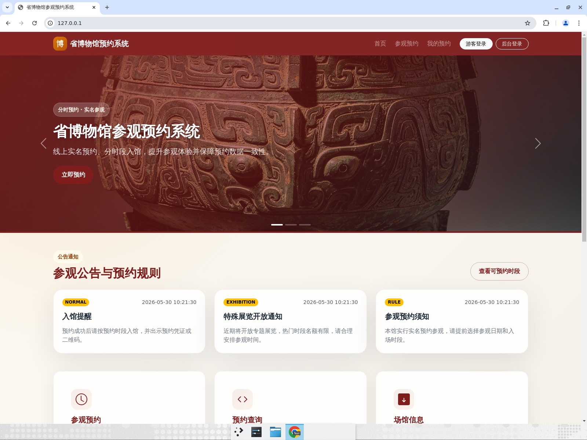
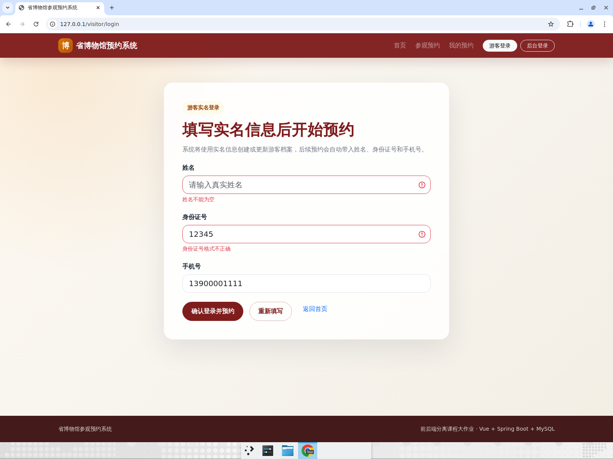
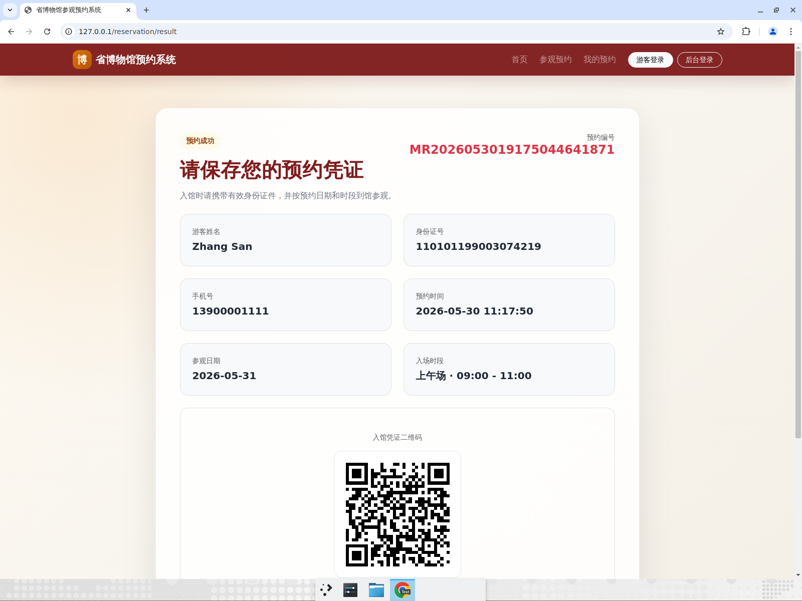
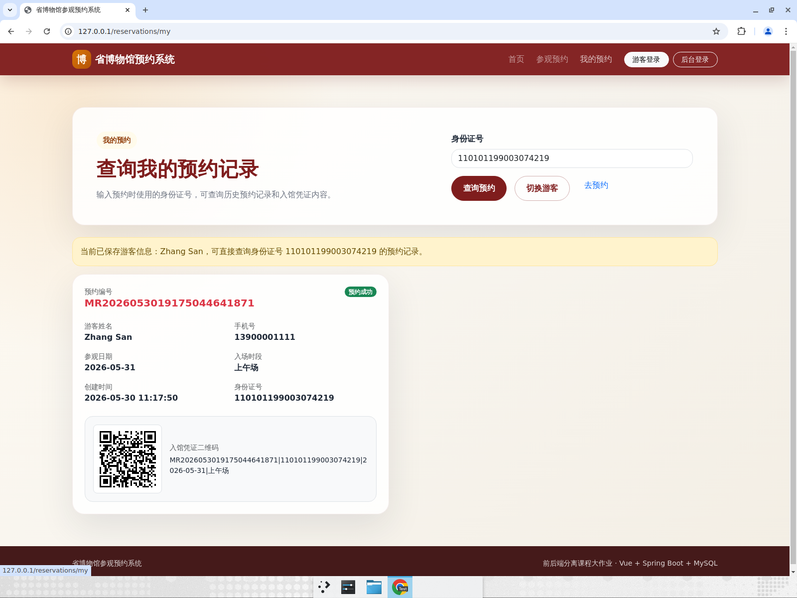
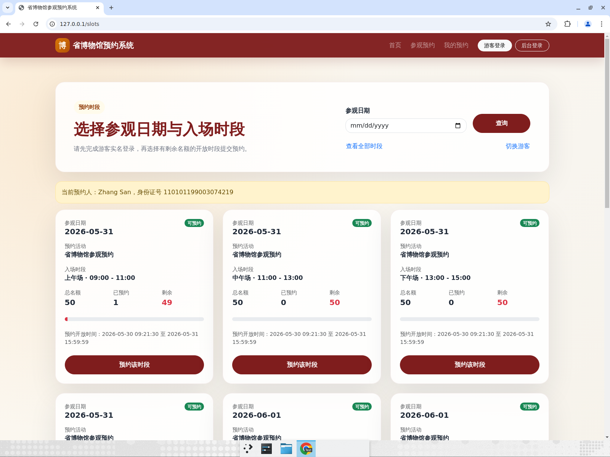
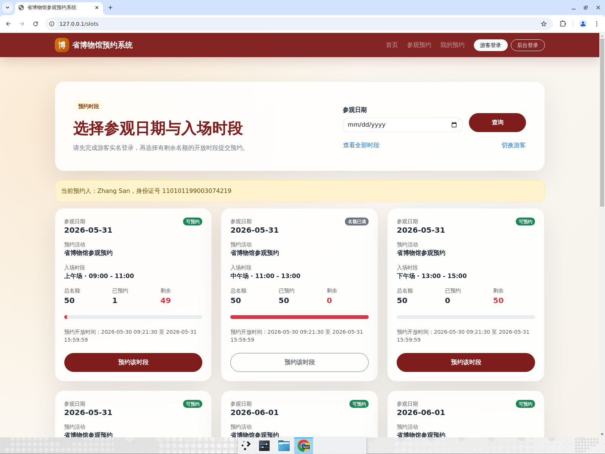
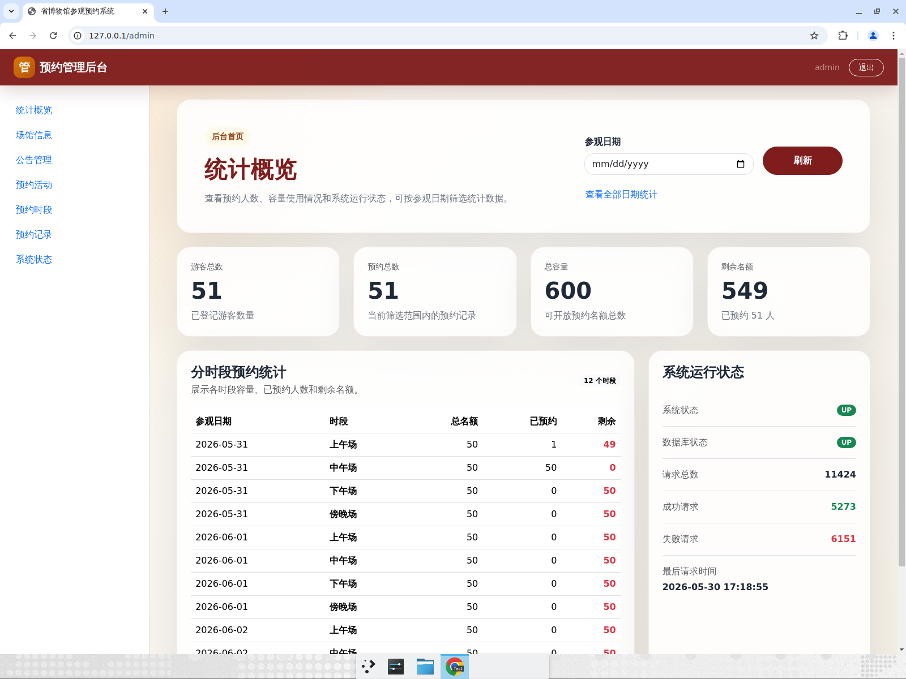
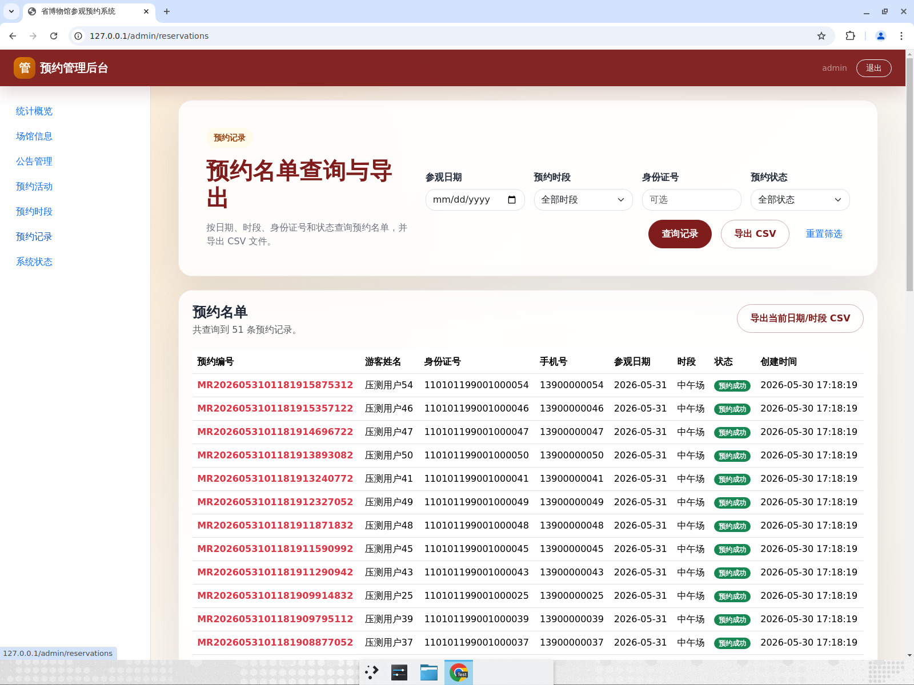
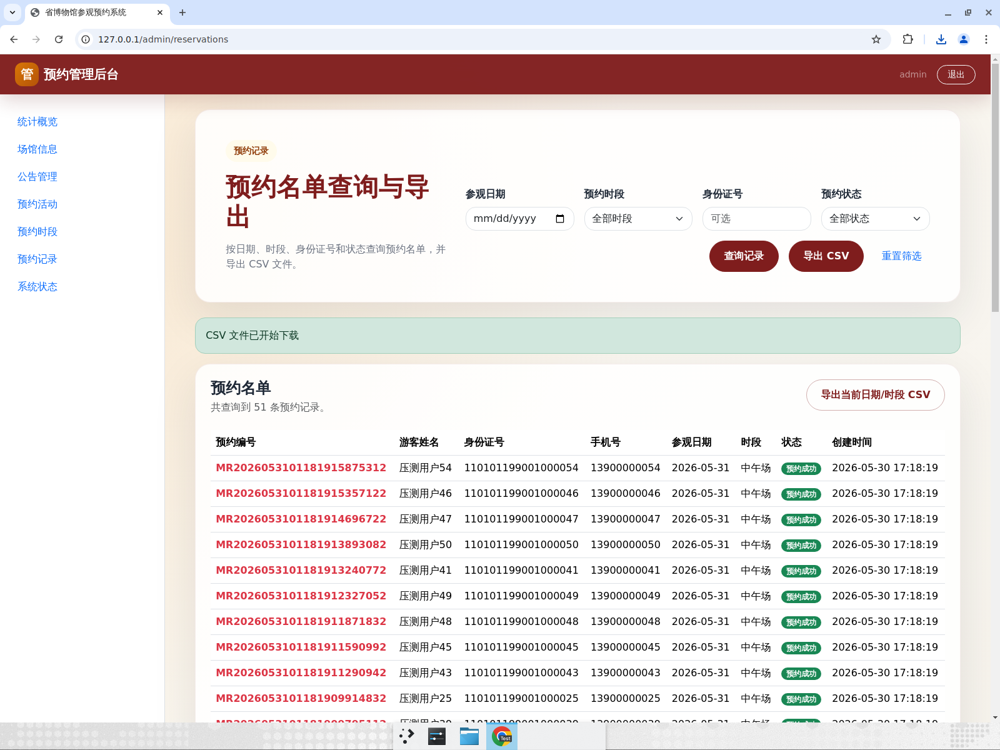
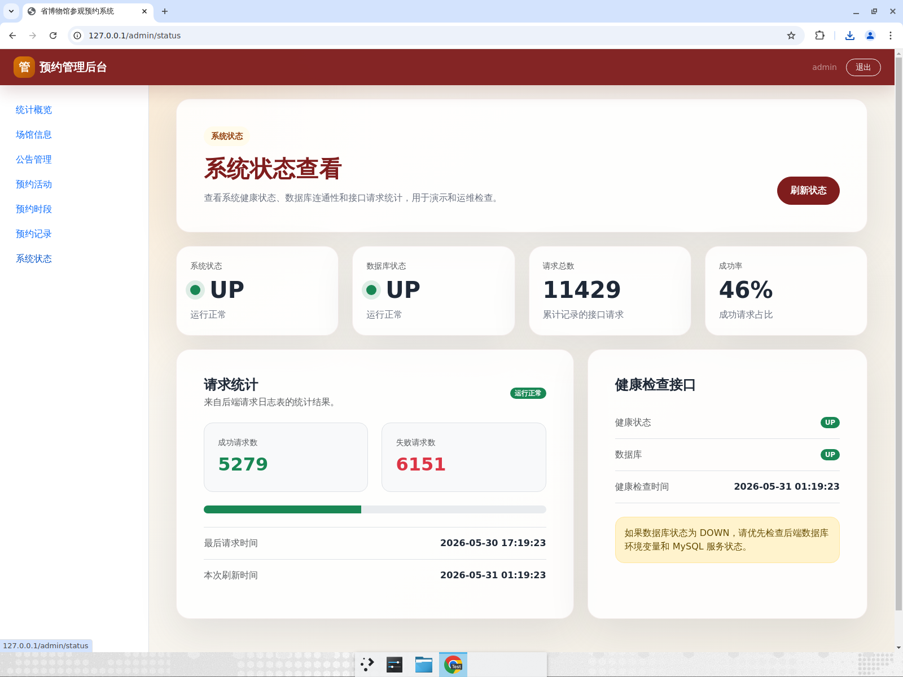

# 省博物馆参观预约系统 · 功能测试报告

> 测试方式：在 Linux（Ubuntu 22.04）真实部署环境上，经 Nginx(:80) → Spring Boot(:8080) → MySQL 8 全链路，使用浏览器进行端到端 UI 测试，并对关键业务规则补充接口/数据层验证。
> 管理员账号：`admin / admin123`。
> 截图目录：`project-docs/screenshots/`。

## 1. 测试环境

| 项 | 值 |
|---|---|
| 操作系统 | Ubuntu 22.04 LTS |
| 部署架构 | Nginx(:80, 托管前端 dist + 反代 `/api`) → Spring Boot(systemd, :8080) → MySQL 8 |
| 后端 | Spring Boot 3.3.5 / Java 21 / JDBC |
| 前端 | Vue 3 + Vite + Bootstrap（生产构建 `VITE_API_BASE_URL=/api`） |
| 访问入口 | `http://127.0.0.1/` |

## 2. 测试结论（概览）

| 用例 | 场景 | 结果 |
|---|---|---|
| FT-A1 | 首页加载（场馆信息、公告、馆藏） | ✅ 通过 |
| FT-A2 | 游客实名登录 | ✅ 通过 |
| FT-A3 | 选择时段并预约成功（含入馆二维码） | ✅ 通过 |
| FT-A4 | 我的预约查询（凭证 + 二维码） | ✅ 通过 |
| FT-B1 | 同人同时段重复预约被拒（不重复） | ✅ 通过 |
| FT-B2 | 满额时段被拒、并发不超额 | ✅ 通过 |
| FT-B3 | 身份证号格式校验拦截 | ✅ 通过 |
| FT-C1 | 管理员登录 + 统计概览 | ✅ 通过 |
| FT-C3 | 预约名单查询 + 导出 CSV | ✅ 通过 |
| FT-C4 | 系统状态（健康检查） | ✅ 通过 |

> 接口层用例 FT-001~027 见仓库既有「功能测试自动执行记录」，本报告补充浏览器端 UI 实测与截图证据。并发一致性的硬证据见 `性能测试报告.md`。

---

## 3. 游客端主流程

### FT-A1 首页加载
- **操作**：浏览器打开 `http://127.0.0.1/`。
- **预期**：显示场馆名称「省博物馆」、开放时间、参观须知、公告列表与馆藏精粹。
- **结果**：✅ 页面正常渲染，公告 3 条、馆藏轮播均显示。



### FT-B3 身份证号格式校验（前端拦截）
- **操作**：游客登录页填写姓名留空、身份证 `12345`、手机号，点击「确认登录并预约」。
- **预期**：前端校验拦截，提示「身份证号格式不正确」「姓名不能为空」，不发起预约。
- **结果**：✅ 校验拦截生效。



### FT-A2 + FT-A3 实名登录并预约成功（含二维码）
- **操作**：填写合法姓名/身份证(18 位)/手机号登录 → 进入时段列表 → 选择「2026-05-31 上午场」→ 二次确认 → 提交。
- **预期**：跳转预约结果页，显示预约编号、游客信息、参观日期/时段，并生成入馆凭证二维码。
- **结果**：✅ 预约成功，预约编号 `MR2026053019175044641871`，二维码正常生成。



### FT-A4 我的预约
- **操作**：进入「我的预约」，按身份证号查询。
- **预期**：列出该游客的预约记录，状态「预约成功」，含入馆二维码。
- **结果**：✅ 正确显示上午场预约记录及二维码。



---

## 4. 业务规则拦截（数据一致性）

### FT-B1 重复预约拦截（不重复）
- **操作**：用同一身份证对同一「上午场」再次提交预约。
- **预期**：被拒绝，提示「您已预约过该时段」，且该时段「已预约」数不变（仍为 1），不产生第二条记录。
- **结果**：✅ UI 端再次提交后「已预约」保持 `1`；接口层返回：
  ```json
  {"success":false,"message":"您已预约过该时段，请勿重复预约","data":null}
  ```
  数据库该时段 `booked_count` 保持 1，无重复记录。



> 说明：前端 `SlotListView` 在预约失败后会立即调用 `loadSlots()` 刷新列表，导致内联错误提示一闪而过，因此采用接口层返回报文佐证拦截文案；数据层「已预约数不变」是更强的证据。

### FT-B2 满额拦截 + 并发不超额
- **操作**：对「中午场（容量 50）」用 200 个不同身份证号、并发 100 高并发抢约（`scripts/perf/concurrency_test.sh 2 50 200 100`）。
- **预期**：恰好 50 个成功，其余被拒；`booked_count == 50`；50 个唯一身份证（无重复）；前台该时段显示「名额已满」且按钮置灰。
- **结果**：✅ 实测：
  ```
  HTTP 200 成功数:  50
  被拒绝(名额满等): 150
  DB booked_count:  50
  DB 预约记录数:    50
  DB 不同身份证数:  50
  [PASS] 成功数 = booked_count = 记录数 = 名额(50)，未超额。
  [PASS] 记录数 = 不同身份证数，无重复预约。
  ```
  前台刷新后「中午场」显示「名额已满」、剩余 0、按钮禁用。



---

## 5. 管理员后台

### FT-C1 管理员登录 + 统计概览
- **操作**：`/admin/login` 输入 `admin/admin123` 登录。
- **预期**：进入后台首页，显示游客总数、预约总数、容量、剩余名额、分时段统计、系统运行状态。
- **结果**：✅ 登录成功，统计与前台一致（上午场已约 1、中午场已约 50/剩余 0），系统/数据库状态 UP。



### FT-C3 预约名单查询 + 导出 CSV
- **操作**：进入「预约记录」查看名单，点击「导出 CSV」。
- **预期**：名单含全部预约（51 条：50 压测 + 1 游客）；点击导出后浏览器下载 CSV 文件。
- **结果**：✅ 名单 51 条；导出文件 `reservations_all_all-slots.csv`，共 52 行（表头 + 51 条），UTF-8（含 BOM），字段：预约编号/游客姓名/身份证号/手机号/参观日期/预约时段/预约状态/创建时间。





### FT-C4 系统状态（健康检查）
- **操作**：进入「系统状态」页。
- **预期**：系统状态 UP、数据库状态 UP、健康检查接口 UP，并显示请求统计。
- **结果**：✅ 全部 UP，显示请求总数/成功/失败统计与最后请求时间。



---

## 6. 复现方式

```bash
# 1) 启动（已部署环境）
sudo systemctl start mysql museum-backend nginx
curl -s http://127.0.0.1/api/health     # 期望 status=UP, database=UP

# 2) 浏览器访问
#   游客端：http://127.0.0.1/        登录→选时段→预约→我的预约
#   管理端：http://127.0.0.1/admin/login   admin/admin123

# 3) 并发不超额实测（容量 50，200 并发请求）
cd museum-reservation-system/scripts/perf
export DB_PASSWORD=Museum@123456
./concurrency_test.sh 2 50 200 100 http://127.0.0.1:8080
```

## 7. 备注（测试中发现的小问题，非阻断）
- 前端 `SlotListView.submitReservation` 在 `catch` 中设置 `errorMessage` 后立即调用 `loadSlots()`，而 `loadSlots()` 开头将 `errorMessage` 重置为空，导致预约失败的内联错误提示几乎不可见。建议：失败时不立即刷新，或刷新后保留错误提示。不影响数据正确性（重复/超额均被正确拒绝）。
